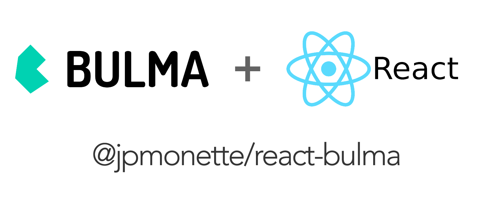

<p align="center">
  
  <br>
  <a href="https://travis-ci.org/jpmonette/react-bulma"></a> <a href='https://coveralls.io/github/jpmonette/react-bulma?branch=master'></a> <a href="https://www.npmjs.com/package/@jpmonette/react-bulma"></a> <a href="https://github.com/facebook/jest"></a> <a href="https://opensource.org/licenses/MIT"></a>
</p>
<p align="center"><code>@jpmonette/react-bulma</code> - Bulma is an <strong>open source CSS framework</strong> based on Flexbox and used by more than 100,000 developers.</p>

---

**👩🏻‍💻 Developer Ready**: Jump-start the development of your app with some beautiful React components.

**💪🏼 Strongly Typed**: Developed using TypeScript / type-safe.

**🔒 Tested**: Tests & snapshot for each components to avoid regressions.

# Getting Started

## Installation

```bash
$ yarn add @jpmonette/react-bulma
```

## Example

WIP
